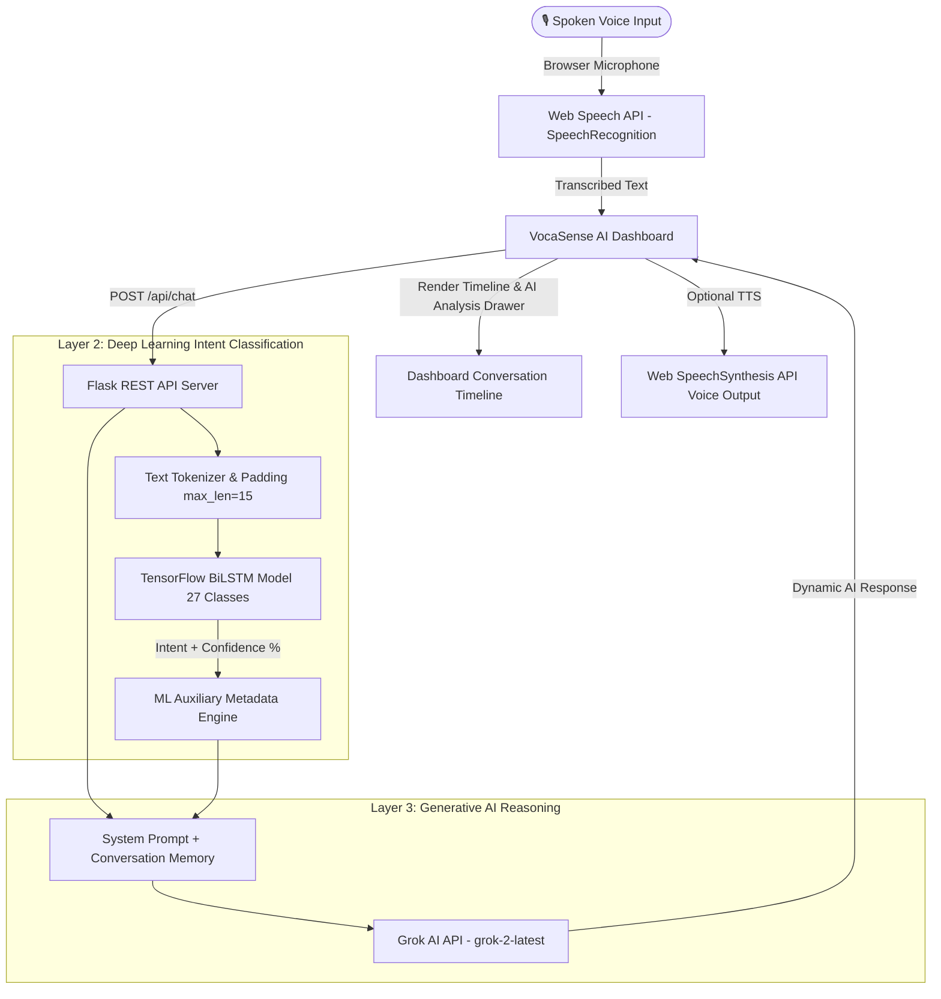

# VocaSense — Voice-Aware Hybrid AI Assistant

> **"Speak naturally. Ask anything."**

VocaSense is an advanced, voice-first hybrid AI assistant that combines browser-native speech recognition (**Web Speech API**), a custom-trained **Bidirectional LSTM (BiLSTM)** Deep Learning intent classifier in TensorFlow/Keras, and **Grok AI (`grok-2-latest`)** for natural, unconstrained conversational reasoning and response generation.

---

## 🌟 Architecture Layers & Hybrid Pipeline



---

## 🚀 Key Highlights & Major Upgrade

- 🤖 **Universal Voice Assistant**: No longer restricted to rigid predefined canned responses. Ask *anything*—casual questions ("I'm hungry", "Tell me a joke"), technical queries ("Write a Python sorting program", "Explain TCP vs UDP"), general knowledge ("Explain quantum computing"), or study help!
- 🧠 **Deep Learning Intent Classifier preserved**: Every request passes through our custom trained 27-class BiLSTM Keras model to predict intent tag and confidence score (e.g. `JOKE_REQUEST`, `confidence: 99.8%`).
- 🤖 **Grok AI Response Generation**: Grok generates natural, context-aware answers using the user's message, recent conversation history, and auxiliary ML intent metadata.
- 🔐 **API Key Security**: `GROK_API_KEY` is strictly managed server-side via `.env` and environment variables. Never exposed to frontend JS or version control.
- 🛡️ **Graceful Fallback**: If `GROK_API_KEY` is not set or network fails, VocaSense seamlessly falls back to the Deep Learning intent engine so the application NEVER crashes!
- 🔍 **Interactive AI Analysis Drawer**: Expandable breakdown revealing Recognized Text, BiLSTM Intent, Model Confidence %, Response Engine (`Grok AI grok-2-latest`), and step-by-step pipeline diagram.

---

## 📊 Dataset & Model Evaluation Results

- **Intent Categories**: 27 distinct classes (`general_greeting`, `goodbye`, `thanks`, `casual_conversation`, `joke_request`, `food_query`, `entertainment`, `weather`, `general_knowledge`, `science`, `technology`, `programming`, `study_help`, `study_plan`, `exam_preparation`, `assignment_help`, `productivity`, `motivation`, `exam_stress`, `campus`, `library`, `events`, `clubs`, `internship`, `resume`, `interview`, `coding_practice`).
- **Test Set Accuracy**: **84.38%**
- **Weighted Precision**: **87.94%**
- **Weighted F1-Score**: **84.15%**

---

## 📁 Project Structure

```
vocasense/
│
├── app/
│   ├── static/
│   │   ├── css/style.css        # Vapi-inspired dark theme stylesheet
│   │   └── js/
│   │       ├── speech.js        # Web Speech STT & TTS handler
│   │       └── app.js           # UI controller & API chat REST client
│   └── templates/
│       └── index.html           # AI Dashboard HTML template
│
├── data/
│   └── intents.json             # 27-intent dataset
│
├── model/
│   ├── intent_model.keras       # Trained Keras BiLSTM model
│   ├── tokenizer.json           # Tokenizer configuration
│   ├── label_encoder.json       # Label encoder mappings
│   └── intent_metadata.json     # Metadata
│
├── training/
│   └── train.py                 # Model training & evaluation script
│
├── static_assets/
│   ├── loss_accuracy_plot.png   # Accuracy/Loss training curves
│   └── confusion_matrix.png    # Test set confusion matrix heatmap
│
├── .env.example                 # Environment variables template
├── .gitignore                    # Version control ignore list (.env protected)
├── app.py                       # Flask server with Grok API integration
├── requirements.txt             # Production dependencies
└── report.md                    # Academic Laboratory Assessment Report
```

---

## 🔑 Environment Setup & Quickstart

1. **Install Dependencies**:
   ```bash
   pip install -r requirements.txt
   ```
2. **Configure API Key**:
   Create a `.env` file in the root directory:
   ```env
   GROK_API_KEY=xai-YOUR_GROK_API_KEY_HERE
   GROK_MODEL=grok-2-latest
   ```
3. **Run Flask App**:
   ```bash
   python app.py
   ```
   Open `http://127.0.0.1:5000` in Google Chrome, Microsoft Edge, or Safari.
# Voice-Enabled-Chatbot-
